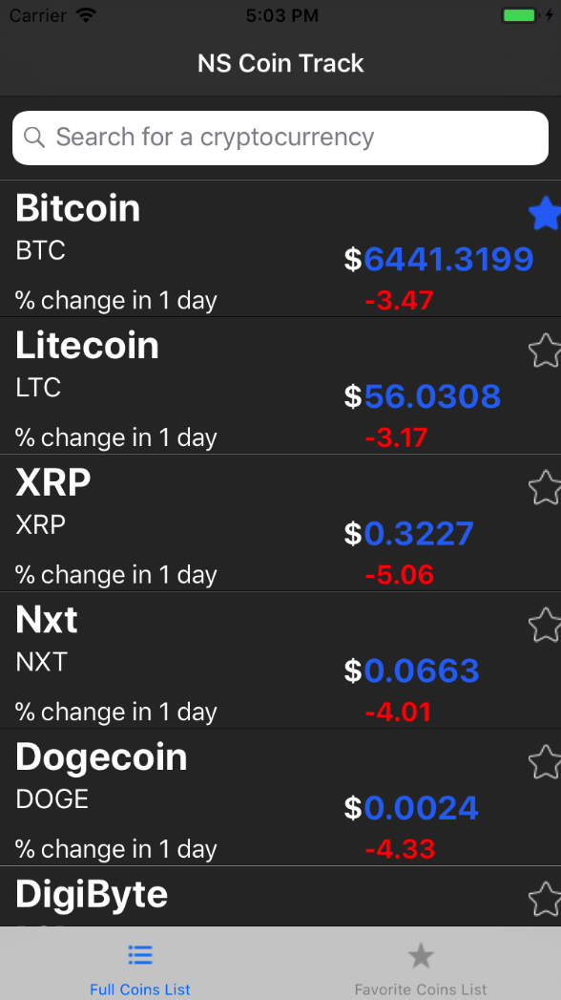
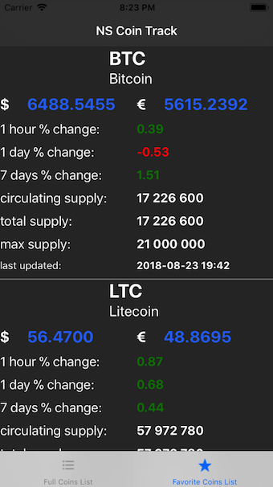
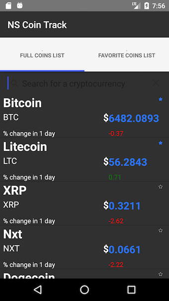
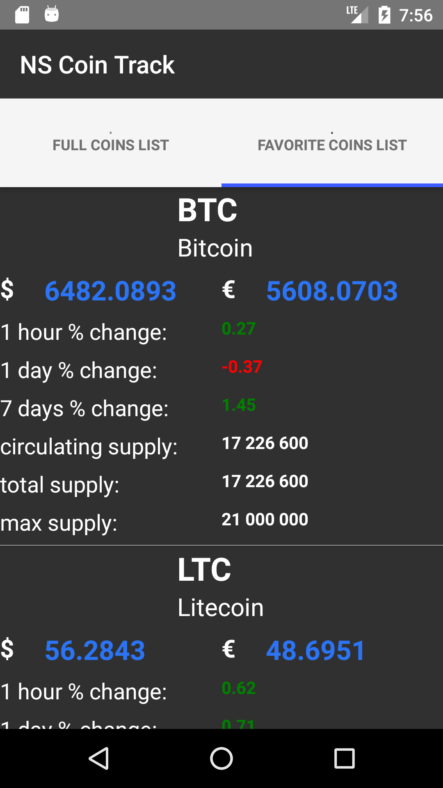

# NS COIN TRACK

## APP

### GENERAL APP DESCRIPTION

An app to track the prices of the latest prices of cryptocurrencies. The application is centered around a TabView with two tabs:

- "Full Coins List": containing the full list of coins as fetched from the coinmarket api.
- "Favorite Coins List": containing specially selected coins in which the user is more interested in

### FUNCTIONALITIES

The user can:

- Browse through the list of coins available from the coin market api
- Check on the full coins list tab the latest:
  - price in USD
  - % change over the last day
- Can add a coin to the list of favorite coins. The list of favorite coins is serialized and the user can have access to it over time in the favorite coins list
- Can search for a specific coin in the full coins list according to the name of the cryptocurrency.

### Tests

The app was tested only simulators (no trials have been made on real machines) and is more production ready for iOS.

### How to run the app

- Clone the repository `https://github.com/ivivanov18/NS-COIN-TRACK`
-

### SCREENSHOTS

#### iOS





#### Android





## ISSUES NOT SOLVED

- `CONSOLE ERROR file:///app/tns_modules/tns-core-modules/trace/trace.js:165:30: Binding: Property: 'onTapStar' is invalid or does not exist. SourceProperty: 'onTapStar'`: this creates some performance problems because this error is being constantly logged on the console.
- RadListView does not get updated on the Full Coin List tab:
  - iOS: when SearchBar is used to filter the results and when I click on one of the filtered results --> the element on which I clicked does not update the image to show it has become a favorite, YET the favorite coins list gets corrected updated. When I clear the searchbar and go back to the full list of coins, ONLY THEN the according item display the right image that shows the element is favorite.
  - Android: on the coins list, when I click on the star to make a coin favorite, the RadListView does not update to show the correct image (that the coin item has become a favorite). I need to scroll the list view downwards or upwards, and therefore make the element I clicked on disappear from the screen, in order the RadListView to update to the correct state (image showing the favorite picture). On the other side, the favorite list gets updated correctly to reflect the adding of the clicked coin to the favorite list.
- RadListView does not updated on the Favorite Coins List Tab:
  - iOS: when a coin is clicked, the RadListView on the Favorite Coins List Tab, does not update. One need to scroll up and down to get it updated and it does always work.
- RadListView: a problem also occurs with the update of the RadListView to reflect the new state of coin (added to favorite) when pullToRefresh="true" was added

## LESSONS LEARNT

- RadListView cannot be used with StackLayout in the following way:

```xml
    <StackLayout>
        <SearchBar></SearchBar>
        <RadListView></RadListView>
    </StackLayout>
```

However, a GridLayout works just fine.

- How to pipe in Nativescript for a ListView --> used appModule.getResources() to pass the function and use it in the xml

## TODO

- Add functionality for app to update prices automatically every 5 minutes.
- Add push notifications: for instance is price has changed more than 10 % in one hour to send a push to inform the user
- Add graphics for the trend of the price --> for this another API must be used
- Add sorting capacities for Full Coin List to sort according to different options "price", "volume", '% change".

## Asset credits

This part is to give credit for the FREE icons that are used in the applications.

-

```html
<div>Icons made by <a href="http://www.freepik.com" title="Freepik">Freepik</a> from <a href="https://www.flaticon.com/" title="Flaticon">www.flaticon.com</a> is licensed by <a href="http://creativecommons.org/licenses/by/3.0/" title="Creative Commons BY 3.0" target="_blank">CC 3.0 BY</a></div>
```

-

```html
<div>Icons made by <a href="https://www.flaticon.com/authors/smashicons" title="Smashicons">Smashicons</a> from <a href="https://www.flaticon.com/" title="Flaticon">www.flaticon.com</a> is licensed by <a href="http://creativecommons.org/licenses/by/3.0/" title="Creative Commons BY 3.0" target="_blank">CC 3.0 BY</a></div>
```

-

```
<div>Icons made by <a href="https://www.flaticon.com/authors/smashicons" title="Smashicons">Smashicons</a> from <a href="https://www.flaticon.com/" title="Flaticon">www.flaticon.com</a> is licensed by <a href="http://creativecommons.org/licenses/by/3.0/" title="Creative Commons BY 3.0" target="_blank">CC 3.0 BY</a></div>
```
