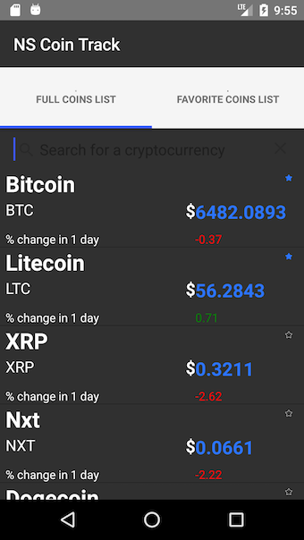
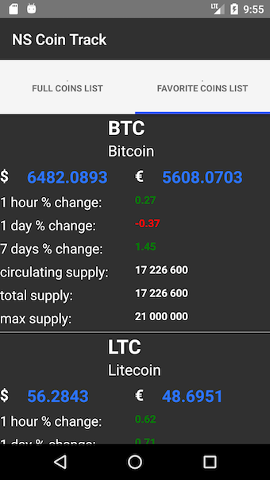

# NS COIN TRACK

## APP

### GENERAL APP DESCRIPTION

An app to track the prices of the latest prices of cryptocurrencies. The application is centered around a TabView with two tabs:

- "Full Coins List": containing the full list of coins as fetched from the coinmarket api.
- "Favorite Coins List": containing specially selected coins in which the user is more interested in

### FUNCTIONALITIES

The user can:

- Browse through the list of coins available from the coin market api
- Check on the full coins list tab the latest:
  - price in USD
  - % change over the last day
- add a coin to the list of favorite coins. The list of favorite coins is serialized and the user can have access to it over time in the favorite coins list
- Search for a specific coin in the full coins list according to the name of the cryptocurrency.
- Pull the Full Coins List Tab View to refresh the data. (Although this creates a problem on iOS. Please see section **Issues Not Solved**)

### Tests

The app was tested only simulators (no trials have been made on real machines).

### How to run the app

- **Pre-requisites**: To run the app, you must have installed:
  - NativeScript cli
  - Android Simulator and/or iPhone Simulator
- Clone the repository `https://github.com/ivivanov18/NS-COIN-TRACK`
- Run `tns run ios` or `tns run android`

### SCREENSHOTS

#### iOS


#### Android





## ISSUES NOT SOLVED YET

- `CONSOLE ERROR file:///app/tns_modules/tns-core-modules/trace/trace.js:165:30: Binding: Property: 'onTapStar' is invalid or does not exist. SourceProperty: 'onTapStar'`: this creates some performance problems because this error is being constantly logged on the console.
- RadListView does not updated on the Favorite Coins List Tab:
  - iOS: when a coin is clicked, the RadListView on the Favorite Coins List Tab, does not update. One need to scroll up and down to get it updated and it does always work. --> ** This solution is not used anyway. Instead a normal list view was used. **
- RadListView: a problem also occurs with the update of the RadListView to reflect the new state of coin (added to favorite) when pullToRefresh="true" was added. Before pulling, update works fine, after pulling to refresh, update does not work.
- Performance issue on iOS: the data is loaded much faster on Android than on iOS. Same for pull to refresh action --> the data updates for several seconds where on Android it seems instantaneuous.

## LESSONS LEARNT

- RadListView cannot be used with StackLayout in the following way:

```xml
    <StackLayout>
        <SearchBar></SearchBar>
        <RadListView></RadListView>
    </StackLayout>
```

However, a GridLayout works just fine.

- How to pipe in Nativescript for a ListView --> used appModule.getResources() to pass the function and use it in the xml

- SOLVED: As advised on the following post https://github.com/telerik/nativescript-ui-feedback/issues/278 --> setTimeout helped also here.

## TODO

- Add functionality for app to update prices automatically every 5 minutes.
- Add push notifications: for instance is price has changed more than 10 % in one hour to send a push to inform the user
- Add graphics for the trend of the price --> for this another API must be used
- Add sorting capacities for Full Coin List to sort according to different options "price", "volume", '% change".
- Icons management for Android
- Refactor styling from xml inline to a separate file

## Assets credits

This part is to give credit for the FREE icons that are used in the applications.

-

```html
<div>Icons made by <a href="http://www.freepik.com" title="Freepik">Freepik</a> from <a href="https://www.flaticon.com/" title="Flaticon">www.flaticon.com</a> is licensed by <a href="http://creativecommons.org/licenses/by/3.0/" title="Creative Commons BY 3.0" target="_blank">CC 3.0 BY</a></div>
```

-

```html
<div>Icons made by <a href="https://www.flaticon.com/authors/smashicons" title="Smashicons">Smashicons</a> from <a href="https://www.flaticon.com/" title="Flaticon">www.flaticon.com</a> is licensed by <a href="http://creativecommons.org/licenses/by/3.0/" title="Creative Commons BY 3.0" target="_blank">CC 3.0 BY</a></div>
```

-

```
<div>Icons made by <a href="https://www.flaticon.com/authors/smashicons" title="Smashicons">Smashicons</a> from <a href="https://www.flaticon.com/" title="Flaticon">www.flaticon.com</a> is licensed by <a href="http://creativecommons.org/licenses/by/3.0/" title="Creative Commons BY 3.0" target="_blank">CC 3.0 BY</a></div>
```

tns install
Copying template files...
Platform ios successfully added. v4.2.0
Copying template files...
Platform android successfully added. v4.2.0
